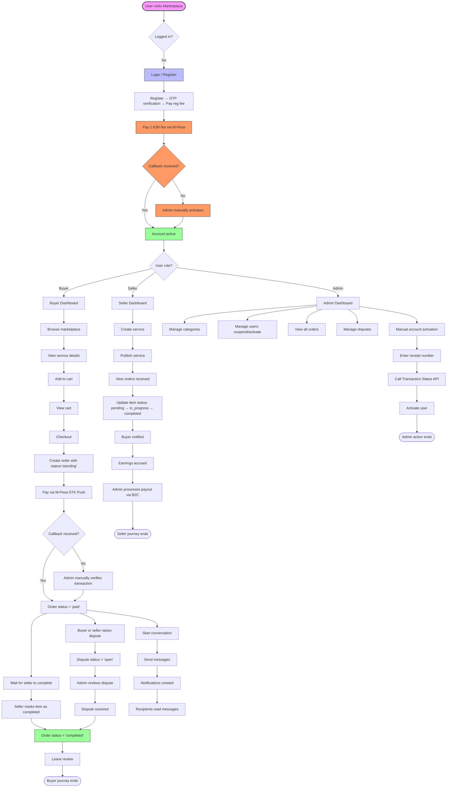
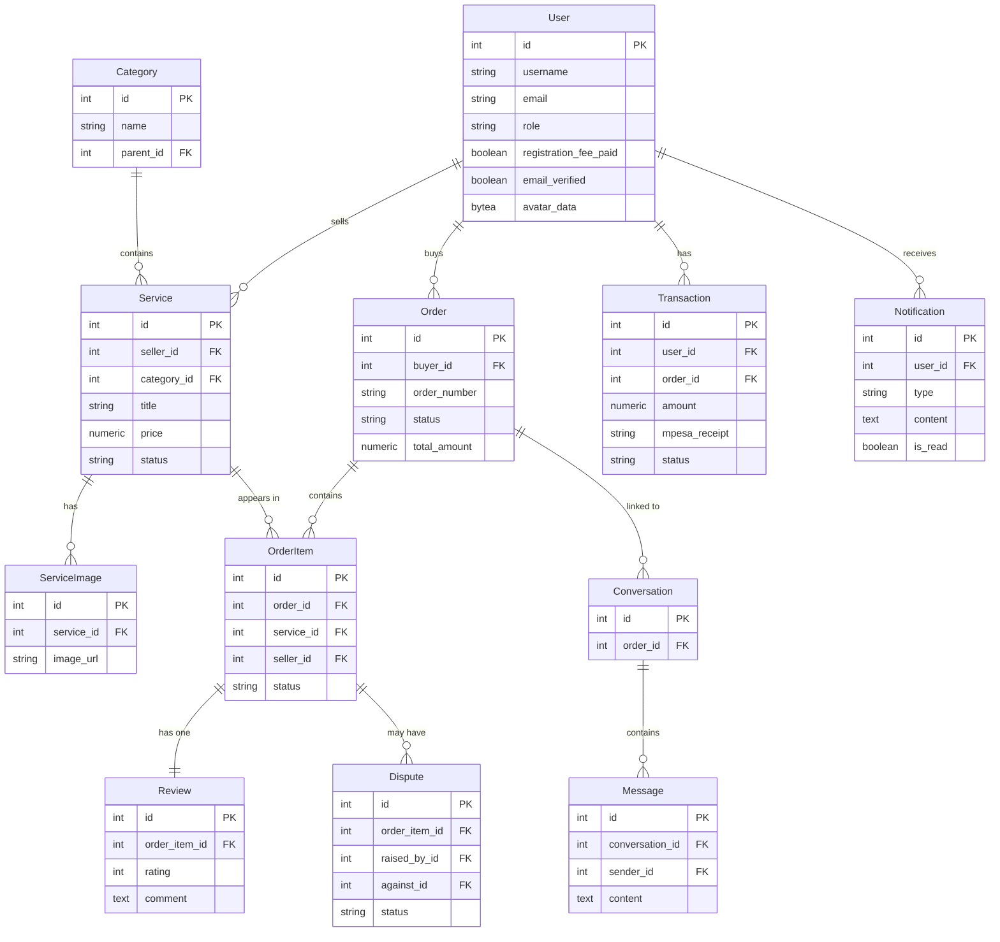

# MARKETPLACE
Its like fiverr, allows one to access market and services from home

## User Flow

```mermaid
flowchart TD
    Start([User visits Marketplace]) --> CheckAuth{Logged in?}
    CheckAuth -->|No| LoginPage[Login / Register]
    LoginPage --> Register[Register → OTP verification → Pay reg fee]
    Register --> PayFee[Pay 1 KSh fee via M-Pesa]
    PayFee --> CallbackFee{Callback received?}
    CallbackFee -->|Yes| Active[Account active]
    CallbackFee -->|No| ManualActivation[Admin manually activates]
    ManualActivation --> Active

    Active --> ChooseRole{User role?}

    %% Buyer Flow
    ChooseRole -->|Buyer| BuyerDashboard[Buyer Dashboard]
    BuyerDashboard --> BrowseServices[Browse marketplace]
    BrowseServices --> ViewService[View service details]
    ViewService --> AddToCart[Add to cart]
    AddToCart --> Cart[View cart]
    Cart --> Checkout[Checkout]
    Checkout --> CreateOrder[Create order with status='pending']
    CreateOrder --> PayOrder[Pay via M-Pesa STK Push]
    PayOrder --> CallbackOrder{Callback received?}
    CallbackOrder -->|Yes| OrderPaid[Order status = 'paid']
    CallbackOrder -->|No| AdminOrderActivation[Admin manually verifies transaction]
    AdminOrderActivation --> OrderPaid
    OrderPaid --> WaitCompletion[Wait for seller to complete]
    WaitCompletion --> SellerCompletes[Seller marks item as completed]
    SellerCompletes --> OrderCompleted[Order status = 'completed']
    OrderCompleted --> LeaveReview[Leave review]
    LeaveReview --> EndBuyer([Buyer journey ends])

    %% Seller Flow
    ChooseRole -->|Seller| SellerDashboard[Seller Dashboard]
    SellerDashboard --> CreateService[Create service]
    CreateService --> PublishService[Publish service]
    PublishService --> ViewOrders[View orders received]
    ViewOrders --> UpdateStatus[Update item status: pending → in_progress → completed]
    UpdateStatus --> NotifyBuyer[Buyer notified]
    NotifyBuyer --> Earnings[Earnings accrued]
    Earnings --> RequestPayout[Admin processes payout via B2C]
    RequestPayout --> EndSeller([Seller journey ends])

    %% Admin Flow
    ChooseRole -->|Admin| AdminDashboard[Admin Dashboard]
    AdminDashboard --> ManageCategories[Manage categories]
    AdminDashboard --> ManageUsers[Manage users: suspend/activate]
    AdminDashboard --> ViewAllOrders[View all orders]
    AdminDashboard --> ManageDisputes[Manage disputes]
    AdminDashboard --> ManualActivationPage[Manual account activation]
    ManualActivationPage --> EnterReceipt[Enter receipt number]
    EnterReceipt --> QueryAPI[Call Transaction Status API]
    QueryAPI --> ActivateUser[Activate user]
    ActivateUser --> EndAdmin([Admin action ends])

    %% Dispute Flow (shared)
    OrderPaid --> RaiseDispute[Buyer or seller raises dispute]
    RaiseDispute --> DisputeOpen[Dispute status = 'open']
    DisputeOpen --> AdminDispute[Admin reviews dispute]
    AdminDispute --> DisputeResolved[Dispute resolved]
    DisputeResolved --> OrderCompleted

    %% Messaging Flow (shared)
    OrderPaid --> StartConversation[Start conversation]
    StartConversation --> SendMessages[Send messages]
    SendMessages --> Notify[Notifications created]
    Notify --> ReadMessages[Recipients read messages]

    %% Styling
    style Start fill:#f9f,stroke:#333,stroke-width:2px
    style LoginPage fill:#bbf,stroke:#333
    style PayFee fill:#f96,stroke:#333
    style CallbackFee fill:#f96,stroke:#333
    style ManualActivation fill:#f96,stroke:#333
    style Active fill:#9f9,stroke:#333
    style OrderCompleted fill:#9f9,stroke:#333
```

## Entity Relationship Diagram

```mermaid
erDiagram
    User {
        int id PK
        string username
        string email
        string role
        boolean registration_fee_paid
        boolean email_verified
        bytea avatar_data
    }
    Category {
        int id PK
        string name
        int parent_id FK
    }
    Service {
        int id PK
        int seller_id FK
        int category_id FK
        string title
        numeric price
        string status
    }
    ServiceImage {
        int id PK
        int service_id FK
        string image_url
    }
    Order {
        int id PK
        int buyer_id FK
        string order_number
        string status
        numeric total_amount
    }
    OrderItem {
        int id PK
        int order_id FK
        int service_id FK
        int seller_id FK
        string status
    }
    Review {
        int id PK
        int order_item_id FK
        int rating
        text comment
    }
    Dispute {
        int id PK
        int order_item_id FK
        int raised_by_id FK
        int against_id FK
        string status
    }
    Transaction {
        int id PK
        int user_id FK
        int order_id FK
        numeric amount
        string mpesa_receipt
        string status
    }
    Conversation {
        int id PK
        int order_id FK
    }
    Message {
        int id PK
        int conversation_id FK
        int sender_id FK
        text content
    }
    Notification {
        int id PK
        int user_id FK
        string type
        text content
        boolean is_read
    }

    User ||--o{ Service : "sells"
    User ||--o{ Order : "buys"
    User ||--o{ Transaction : "has"
    User ||--o{ Notification : "receives"
    Service ||--o{ ServiceImage : "has"
    Service ||--o{ OrderItem : "appears in"
    Category ||--o{ Service : "contains"
    Order ||--o{ OrderItem : "contains"
    OrderItem ||--|| Review : "has one"
    OrderItem ||--o{ Dispute : "may have"
    Order ||--o{ Conversation : "linked to"
    Conversation ||--o{ Message : "contains"
```
